# Resource State Lifecycle

Resources in SECA follow a reconciliation-based lifecycle model. This document describes the detailed state transitions that occur as the control plane reconciles the desired state (spec) with the actual state (status).

## Overview

When a resource is submitted to the API, it enters a continuous reconciliation loop managed by the control plane. The reconciler watches for changes to resources and works to align the actual state with the desired state declared in the spec.

## State Diagram

```mermaid
flowchart TD
    Start(( )) -->|Resource Submitted| pending
    pending -->|Reconciler Picks Up| creating
    creating -->|Creation Complete| active
    creating -->|Creation Failed| error
    active -->|Spec Changed| updating
    active -->|Delete Requested| deleting
    updating -->|Update Complete| active
    updating -->|Update Failed| error
    error -->|Retry if new| creating
    error -->|Retry if exists| updating
    error -->|Delete Requested| deleting
    deleting -->|Finalizers Complete| End(( ))

    classDef success fill:#10b981,color:#fff,stroke:#10b981
    classDef error fill:#ef4444,color:#fff,stroke:#ef4444
    classDef progress fill:#3b82f6,color:#fff,stroke:#3b82f6
    classDef point fill:#333,stroke:#333

    class active success
    class error error
    class pending,creating,updating,deleting progress
    class Start,End point

    linkStyle 0,1,2,4,5,6,11 stroke:#10b981,stroke-width:2px
    linkStyle 3,7 stroke:#ef4444,stroke-width:2px
    linkStyle 8,9,10 stroke:#f59e0b,stroke-width:2px
```

## State Descriptions

| State | Description |
|-------|-------------|
| `pending` | The resource has been submitted to the API and accepted. The desired state has been declared and stored, awaiting the reconciler to begin processing. |
| `creating` | The reconciler has picked up the resource and is provisioning it. Backend systems are being configured. |
| `active` | The resource is fully provisioned and operational. The current state matches the desired state. |
| `updating` | A change to the spec has been detected. The reconciler is applying the new desired state. |
| `error` | Reconciliation has failed. The resource may be partially provisioned. Automatic retry may occur. |
| `deleting` | Deletion has been requested. The reconciler is running finalizers and cleaning up backend resources. |

## State Transitions

### Successful Lifecycle

1. **Resource Submitted** - User creates a resource via PUT request
2. `pending` - API accepts the resource, stores the desired state
3. `creating` - Reconciler detects new resource, begins provisioning
4. `active` - Provisioning completes, resource is ready for use

### Update Flow

1. `active` - Resource is operational
2. **Spec Changed** - User updates the resource via PUT request
3. `updating` - Reconciler detects spec change, applies modifications
4. `active` - Update completes, new desired state achieved

### Error Handling

When reconciliation fails:

- The resource enters the `error` state
- The `conditions` array is updated with failure details
- The reconciler may automatically retry based on the error type
- Transient errors (network issues, temporary unavailability) trigger automatic retry
- Permanent errors (invalid configuration, quota exceeded) require user intervention

### Deletion Flow

1. **Delete Requested** - User sends DELETE request
2. `deleting` - Resource marked with `deletedAt` timestamp
3. **Finalizers Execute** - Cleanup operations run (detach volumes, release IPs, etc.)
4. **Resource Removed** - Resource is removed from the system

## Status State Values

The `status.state` field directly reflects the current internal state as one of:

| `status.state` | Description |
|----------------|-------------|
| `pending` | Awaiting reconciliation |
| `creating` | Provisioning in progress |
| `active` | Resource ready and operational |
| `updating` | Update in progress |
| `deleting` | Deletion in progress |
| `error` | Reconciliation failed |

These are the exact string values returned in the API response.

## Conditions and Observability

Each state transition generates a condition entry in the `status.conditions` array, providing a historical audit trail. Conditions capture what changed, when it changed, and why - enabling clients to track transitions and debug issues.

For detailed information about status fields, conditions structure, and practical examples, see [Resource Model - Status](06-resource-model.md#status).

## Best Practices

### For API Consumers

- Implement exponential backoff when polling for state changes
- Use conditions to understand why a resource is in a particular state
- Handle the `error` state gracefully - check conditions for retry guidance

### For Resource Providers

- Ensure idempotent reconciliation logic
- Implement proper finalizers for cleanup during deletion
- Provide meaningful error messages in conditions
- Support automatic retry for transient failures
